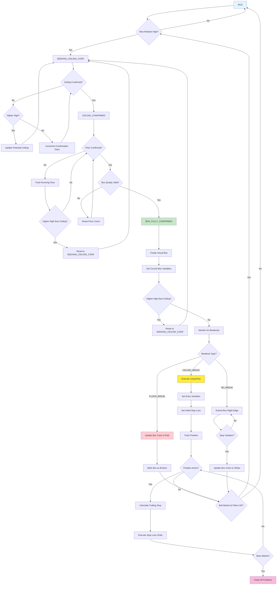

# Darvas Box Strategy - Flow Diagram

Este diagrama representa la lógica de estados de la estrategia Darvas Box implementada en `strategies/darvas-box.pine`.

## Diagrama de Flujo

## Descripción de Estados

### Estados Principales

1. **IDLE**: Estado inicial, esperando nuevos máximos relativos
2. **SEEKING_CEILING_CONF**: Confirmando el techo de una posible caja Darvas
3. **CEILING_CONFIRMED**: Techo confirmado, buscando confirmación del piso
4. **BOX_FULLY_CONFIRMED**: Caja completamente formada, monitoreando breakouts

### Condiciones de Transición

- **New Relative High**: Precio actual supera el máximo de los últimos N períodos
- **Ceiling Confirmed**: N barras consecutivas sin nuevos máximos
- **Floor Confirmed**: N barras consecutivas sin nuevos mínimos
- **Box Quality Valid**: La caja cumple criterios de ancho mínimo y altura mínima
- **Breakout Detection**: Precio rompe por encima o debajo de los límites de la caja

### Tipos de Breakout

- **CEILING_BREAK**: Precio rompe por encima del techo → Entrada larga
- **FLOOR_BREAK**: Precio rompe por debajo del piso → Caja inválida
- **NO_BREAK**: Precio permanece dentro de la caja → Continuar monitoreando

### Gestión de Riesgo

- **Initial Stop Loss**: Establecido en el piso de la caja de entrada
- **Trailing Stop**: Se actualiza cuando se forman nuevas cajas a niveles superiores
- **Bear Market Exit**: Salida forzada cuando las condiciones de mercado se deterioran

### Filtros de Calidad

- **Market Trend Filter**: Solo opera en mercados alcistas
- **Annual High Filter**: Solo forma cajas cerca de máximos anuales
- **Volume Filter**: Requiere volumen elevado en breakouts
- **Box Quality**: Ancho mínimo y altura mínima de cajas

## Colores del Diagrama

- **Azul claro**: Estado inicial (IDLE)
- **Verde**: Estado de confirmación completa (BOX_FULLY_CONFIRMED)
- **Amarillo**: Ejecución de entrada (Execute Long Entry)
- **Rojo**: Breakouts de piso (Floor Break)
- **Rosa**: Salidas forzadas (Bear Market Exit)