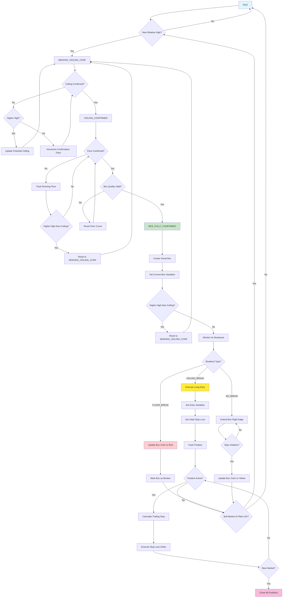

# Darvas Box Strategy - Low-Level Flow Diagram

This diagram represents the state machine logic of the Darvas Box strategy implemented in `strategies/darvas-box.pine`.

## State Flow Diagram

## State Descriptions

### Main States

1. **IDLE**: Initial state, waiting for new relative highs
2. **SEEKING_CEILING_CONF**: Confirming the ceiling of a potential Darvas box
3. **CEILING_CONFIRMED**: Ceiling confirmed, seeking floor confirmation
4. **BOX_FULLY_CONFIRMED**: Box fully formed, monitoring for breakouts

### Transition Conditions

- **New Relative High**: Current price exceeds the maximum of the last N periods
- **Ceiling Confirmed**: N consecutive bars without new highs
- **Floor Confirmed**: N consecutive bars without new lows
- **Box Quality Valid**: Box meets minimum width and height criteria
- **Breakout Detection**: Price breaks above or below box boundaries

### Breakout Types

- **CEILING_BREAK**: Price breaks above ceiling → Long entry
- **FLOOR_BREAK**: Price breaks below floor → Box invalidated
- **NO_BREAK**: Price remains within box → Continue monitoring

### Risk Management

- **Initial Stop Loss**: Set at the floor of the entry box
- **Trailing Stop**: Updated when new boxes form at higher levels
- **Bear Market Exit**: Forced exit when market conditions deteriorate

### Quality Filters

- **Market Trend Filter**: Only trades in bull markets
- **Annual High Filter**: Only forms boxes near annual highs
- **Volume Filter**: Requires elevated volume on breakouts
- **Box Quality**: Minimum width and height requirements

## Diagram Colors

- **Light Blue**: Initial state (IDLE)
- **Green**: Full confirmation state (BOX_FULLY_CONFIRMED)
- **Yellow**: Entry execution (Execute Long Entry)
- **Red**: Floor breakouts (Floor Break)
- **Pink**: Forced exits (Bear Market Exit)