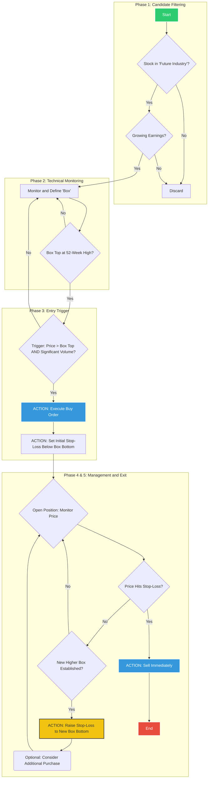

# Darvas Box Strategy - High-Level Trading Method

This diagram represents the high-level trading methodology of the Darvas Box strategy, following Nicolas Darvas' original approach for identifying and trading growth stocks.

## High-Level Trading Flow

## Trading Method Overview

### Phase 1: Candidate Filtering
The Darvas method begins with fundamental screening to identify promising growth stocks:

- **Future Industries**: Focus on emerging sectors with high growth potential
- **Growing Earnings**: Companies showing consistent earnings growth
- **Market Leadership**: Stocks that demonstrate strong relative performance

### Phase 2: Technical Monitoring
Once fundamentally sound candidates are identified:

- **Box Formation**: Monitor price action to identify consolidation patterns (boxes)
- **52-Week High Proximity**: Boxes should form near or at 52-week highs
- **Volume Analysis**: Track volume patterns during consolidation

### Phase 3: Entry Trigger
Entry occurs when specific technical conditions align:

- **Breakout Confirmation**: Price breaks above the box top (resistance)
- **Volume Confirmation**: Breakout accompanied by significantly higher volume
- **Buy Stop Order**: Mechanical entry system to capture momentum

### Phase 4: Risk Management
Immediate risk control upon entry:

- **Initial Stop-Loss**: Placed below the box bottom (support level)
- **Mechanical Exit**: No emotions - exit immediately if stop is hit
- **Position Sizing**: Risk management through proper position sizing

### Phase 5: Profit Management
Trailing stop system for profit maximization:

- **Box Progression**: Monitor for new boxes forming at higher levels
- **Trailing Stops**: Raise stop-loss to the bottom of each new higher box
- **Pyramiding**: Optional additional purchases on new box breakouts
- **Trend Following**: Stay with the trend as long as boxes continue forming higher

## Key Principles

1. **Systematic Approach**: Removes emotion from trading decisions
2. **Trend Following**: Rides strong uptrends in leading stocks
3. **Risk Control**: Strict stop-loss discipline limits downside
4. **Profit Maximization**: Trailing stops capture extended moves
5. **Quality Focus**: Only trades the strongest stocks in the strongest sectors

## Color Legend

- **Green**: Start point - Beginning of analysis
- **Red**: End point - Position closed
- **Blue**: Action points - Buy/Sell execution
- **Yellow**: Management actions - Stop-loss adjustments
- **White**: Decision points - Conditional logic