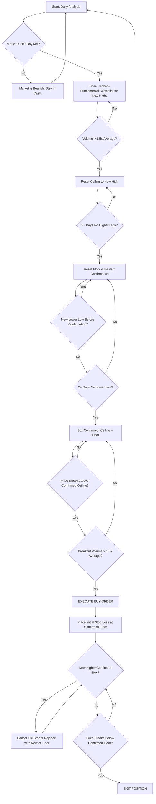

# Darvas Box: An Investment Thesis on Momentum

## 1. Core Thesis

Our investment thesis is centered on the principle of **compounding capital by systematically investing in market-leading stocks that exhibit strong relative strength and upward momentum**. We operate on the conviction that stocks making new highs, backed by institutional volume, are more likely to continue their trajectory than to reverse.

This is a **trend-following, long-only strategy**. Our primary goal is not to "buy low and sell high," but rather to **"buy high and sell higher."** Capital preservation is paramount; therefore, the strategy is designed to remain in cash during confirmed bear markets, avoiding significant drawdowns.

---

## 2. The "Techno-Fundamental" Overlay

While the algorithm is primarily technical, Darvas applied a crucial layer of qualitative fundamental analysis to filter his watchlist. This was not traditional value investing; it was a forward-looking assessment of a company's potential to dominate a high-growth industry. The fundamental criteria are applied **before** the technical analysis begins.

1.  **Industry Leadership & Future Potential:** The stock must belong to an industry with a compelling narrative of future growth and innovation. Darvas sought out companies in revolutionary fields (in his time, electronics and rocketry) that were poised for explosive expansion. The core question is: _"Is this company in a business that will be significantly larger and more important in the coming years?"_

2.  **Evidence of Increasing Earnings Power:** The primary fundamental driver is a company's capacity to dramatically increase its earnings. This can be confirmed through recent earnings reports showing strong acceleration or through a strong market anticipation of future earnings breakthroughs due to new products or market conditions. Darvas believed that sustained, powerful price trends are ultimately slaves to "earnings power."

3.  **A Filter, Not a Predictor:** Fundamental analysis is used to create a high-potential watchlist of stocks worth monitoring. It is **not** used to predict _when_ a stock will move. The technical breakout (Phase III) is the sole trigger for action. The strong fundamental story provides the conviction to hold the stock through its trend and manage the position according to the strict technical rules.

> 🔑 **Key principle:** We are not looking for undervalued companies. We are looking for correctly valued, high-growth companies whose future potential is just beginning to be priced in by the market.

---

## 3. The Trading Algorithm

The execution of this thesis is governed by a strict, non-discretionary mechanical algorithm.

### **Phase I: Market Condition Analysis**

- **Rule:** The broad market index (e.g., S&P 500 via SPY) **must** be trading above its 200-day simple moving average.
- **Action:** If this condition is not met, the market is considered bearish. No new positions will be initiated. All existing positions are evaluated for immediate closure.

### **Phase II: Stock Screening & Box Definition**

1.  **Screening:** Scan for stocks from the "Techno-Fundamental" watchlist that are making new relative highs (often near 52-week or all-time highs).
2.  **Volume Confirmation:** The move to this new high must be accompanied by a trading volume at least **1.5x greater** than its 50-day average volume.
3.  **Define Potential Box Ceiling (Resistance):**
    - Identify the highest price point reached (swing high).
    - That high becomes a _potential ceiling_ if, during the **next 2+ trading days**, the stock fails to exceed it.
4.  **Define Potential Box Floor (Support):**
    - After the ceiling, observe the subsequent pullback.
    - The lowest price reached in that pullback is a _potential floor_.
    - That low becomes a _confirmed floor_ if, during the **next 2+ trading days**, the stock does not trade below it.
5.  **Adjustments:**
    - If a **new higher high** occurs before ceiling confirmation → reset the potential ceiling to that level.
    - If a **new lower low** occurs before floor confirmation → reset the potential floor and restart confirmation.
6.  **Box Validity:** A box is only valid when **both ceiling and floor have been confirmed** by subsequent price action.

> 🔑 **Key principle:** Both sides of the box must be confirmed by time and price action. A box cannot be declared valid without this dual confirmation.

---

### **Phase III: Trade Execution & Management**

| Parameter              | Rule                                                                                                                                                | Action                                                                      |
| :--------------------- | :-------------------------------------------------------------------------------------------------------------------------------------------------- | :-------------------------------------------------------------------------- |
| **Entry Trigger**      | The stock's price closes **above the _confirmed_ Box Ceiling**.                                                                                     | A buy signal is generated.                                                  |
| **Volume Check**       | The breakout day’s volume must be **> 1.5x** the 50-day average volume.                                                                             | If true, proceed. If false, the signal is invalid.                          |
| **Buy Order**          | Place a **Buy Stop Limit Order** slightly above the Box Ceiling to automate entry on breakout.                                                      | Execute the purchase.                                                       |
| **Initial Stop Loss**  | Immediately upon entry, place a **Stop Loss Order** at the **confirmed Box Floor**.                                                                 | This defines the maximum acceptable loss for the trade.                     |
| **Trailing Stop Loss** | As the stock forms a new, higher, confirmed box, the previous Stop Loss is **cancelled and replaced** by a new one at the **floor of the new box**. | This locks in profits while allowing the trend to continue.                 |
| **Exit Signal (Sell)** | The stock’s price closes **below the _confirmed_ Box Floor** of the most recent box.                                                                | The single active Stop Loss order is triggered, and the position is closed. |

---

### **Important Note on Risk Management**

- **One Active Stop Loss:** At any given time, there is only **one active Stop Loss** for the entire position. When the stop is trailed up to a new box floor, the old order is cancelled. The system does not accumulate multiple stop orders.
- **No "Take Profit" Targets:** The Darvas method is a pure trend-following system. It **does not use pre-defined "Take Profit" targets**. The position is allowed to run indefinitely as long as the uptrend remains intact (i.e., as long as the trailing stop loss is not triggered). The exit is determined solely by the trend's failure, not by a profit objective.

---

## 4. Visual Flowchart (Mermaid)

This flowchart illustrates the complete decision-making process with the corrected confirmation logic.

